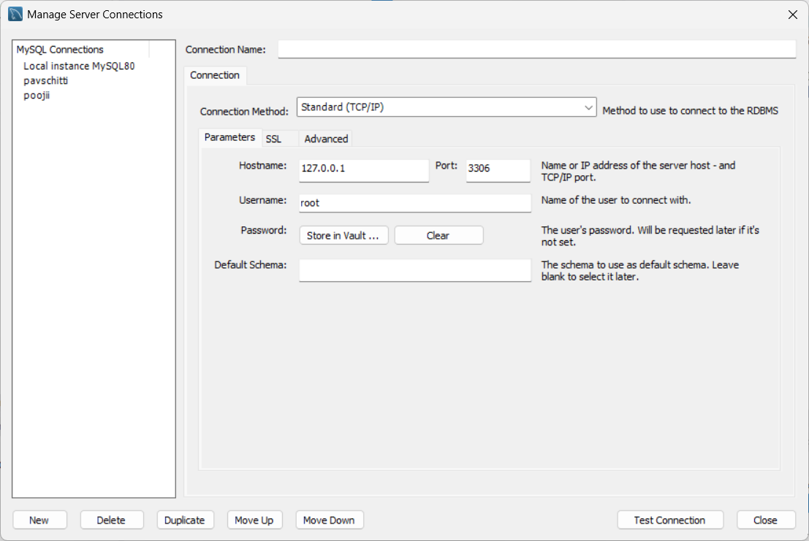
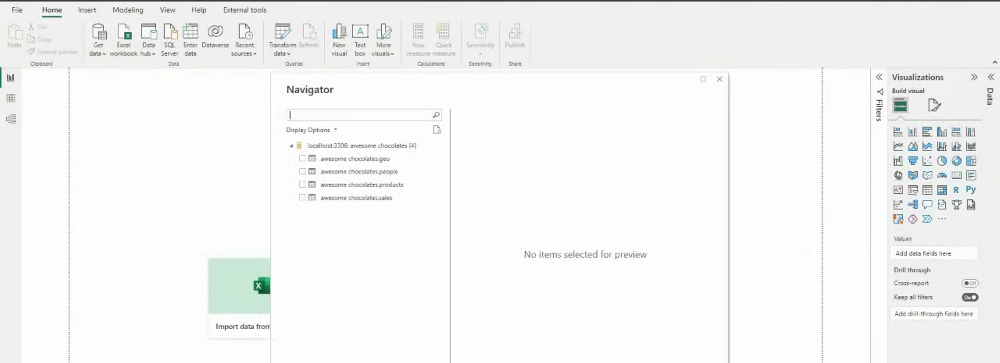
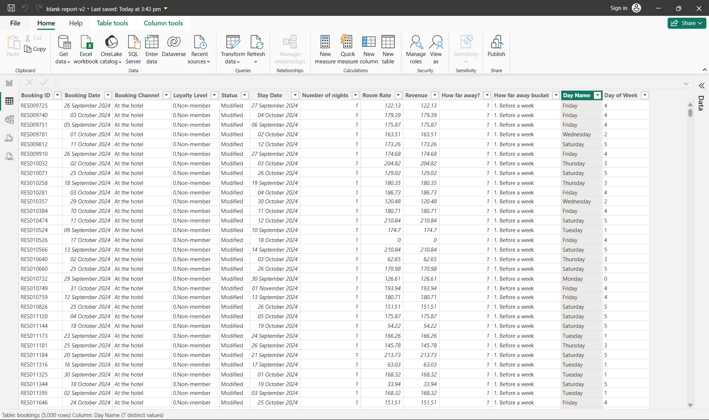
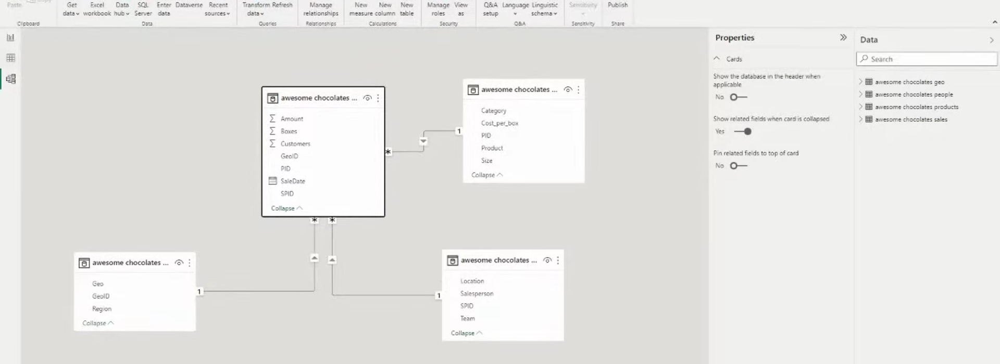

# Power BI - MySQL Database Integration and Data Modeling

## Project Overview

This project demonstrates the process of connecting a MySQL database to Power BI, importing tables, validating data, and building a semantic data model for reporting and analytics.

The workflow covers database connectivity, data loading, data validation, and relationship modeling to create a structured foundation for business intelligence reporting.

---

## SQL Database Connection

Established a connection between Power BI and a MySQL database using the server host, port number, username, password, and database schema details. This connection serves as the primary source for importing and analyzing data within Power BI.

---

## Loading SQL Tables into Power BI

Connected to the MySQL database through Power BI Navigator and selected the required tables for analysis. The data was either loaded directly into Power BI or transformed using Power Query to ensure data quality and consistency.

---

## Data View

Verified the imported tables in Power BI's Data View. This step was used to inspect records, validate data types, identify missing values, and confirm that the imported data was ready for reporting and visualization.

---

## Semantic Data Model

Designed a semantic data model by creating relationships between fact and dimension tables. Proper relationship management enables accurate filtering, aggregation, and drill-down analysis while improving overall report performance.

---

## Key Skills Demonstrated

* MySQL Database Connectivity
* Power BI Data Import
* Power Query Transformations
* Data Validation and Cleaning
* Data Modeling
* Relationship Management
* Business Intelligence Reporting
* Semantic Model Design

---

## Tools Used

* Power BI Desktop
* MySQL Database
* Power Query
* Data Modeling Techniques

---

## Learning Outcomes

* Connected Power BI to a relational database.
* Imported and transformed SQL data efficiently.
* Validated and prepared data for analysis.
* Built a semantic model using table relationships.
* Created a scalable foundation for business intelligence reporting.
